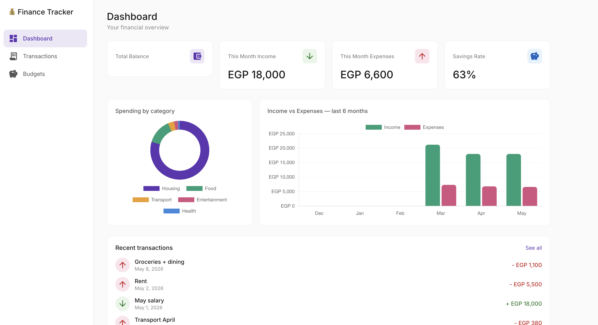
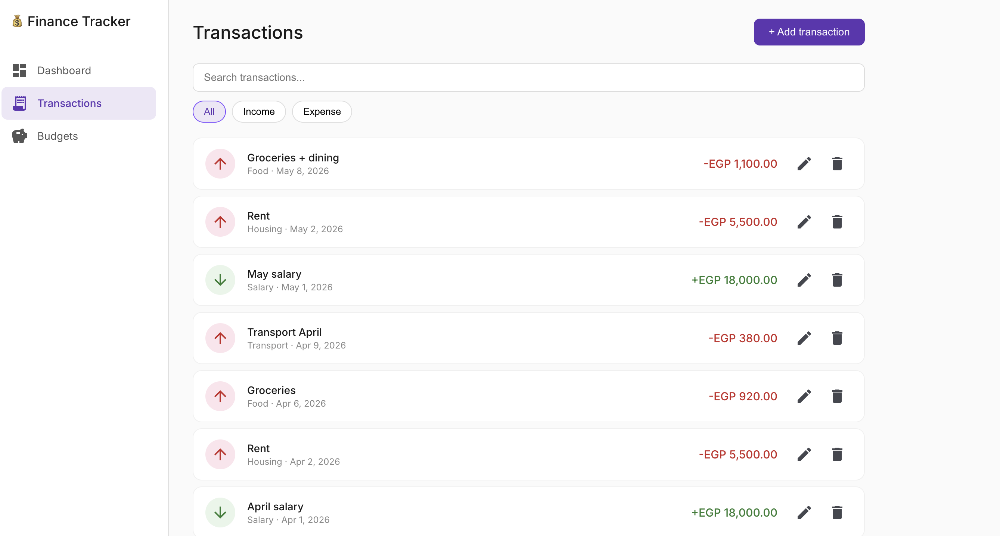
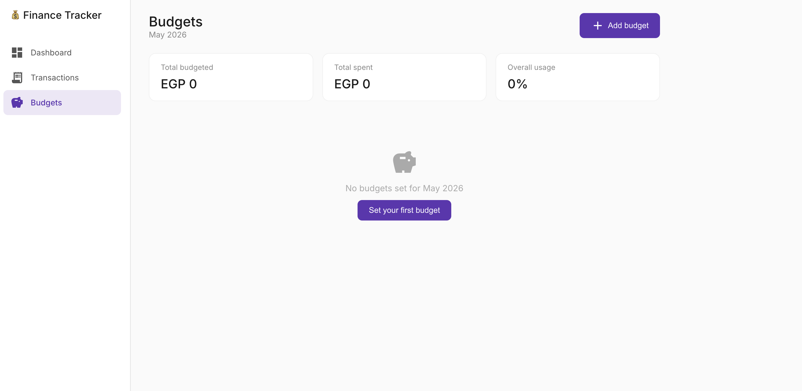

# 💰 Finance Tracker

A personal finance management app built with **Angular 21** and **Angular Material**.
Track income and expenses, visualize spending patterns, and set monthly budget goals.

🔗 **[Live Demo](https://financial-tracker-tawny-two.vercel.app/dashboard)**

---

## Screenshots

> 

> 

> 

---

## Features

- **Dashboard** — balance overview, spending by category (donut chart),
  income vs expenses over 6 months (bar chart), recent transactions
- **Transactions** — add, edit, delete transactions with real-time search and filters
- **Budgets** — set monthly spending limits per category with progress tracking
  and warning states

---

## Tech stack

### Made with vibe coding using Claude Code

| Tech | Purpose |
|------|---------|
| Angular 21 | Framework — standalone components, signals, computed |
| Angular Material | UI component library |
| Chart.js + ng2-charts | Data visualization |
| date-fns | Date formatting and calculations |
| localStorage | Client-side persistence (no backend needed) |
| Prettier + ESLint | Code quality and formatting |

---

## Angular concepts demonstrated

- **Signals & computed()** — reactive state without RxJS boilerplate
- **Smart / dumb component pattern** — clear separation of data and presentation
- **Lazy loading** — each feature loads only when navigated to
- **Reactive Forms** — with validators and error messages
- **Angular Material dialogs** — data in via MAT_DIALOG_DATA, result out via afterClosed()
- **Feature-based folder structure** — scalable architecture

---

## Run locally

```bash
git clone repo url
cd financial-tracker
npm install
ng serve
```

Open `http://localhost:4200`
